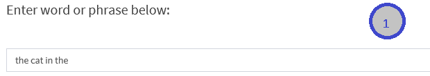
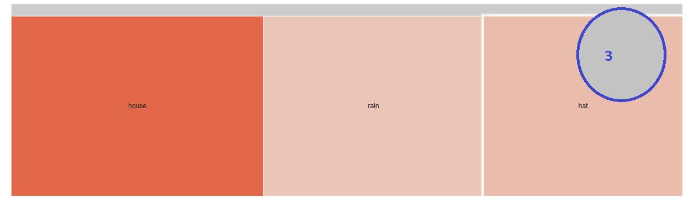

Next Word Prediction
========================================================
author: Jacob Govshteyn
date: Aug 2015

- [*Word Predictor Shiny app*](https://jacob-govshteyn.shinyapps.io/NextWordKnModel)  

App description
========================================================

__Internals:__

Ngrams in the range of 2-5 where constructed from ~150,000 lines of news, blogs , and twitter social media training data entries:

To analyze n-gram frequencies, the following preprocessing steps were performed:

1. Remove punctuation from text corpus.
3. Transform words to lower case.
3. Strip text of additional white spaces.
4. replaced all sparse words with an `<UNK>` placeholder

How the app works:
========================================================

_Enter Partial Phrase in Text Box_

_Submit Server Request_
 

_Complete The Phrase_

